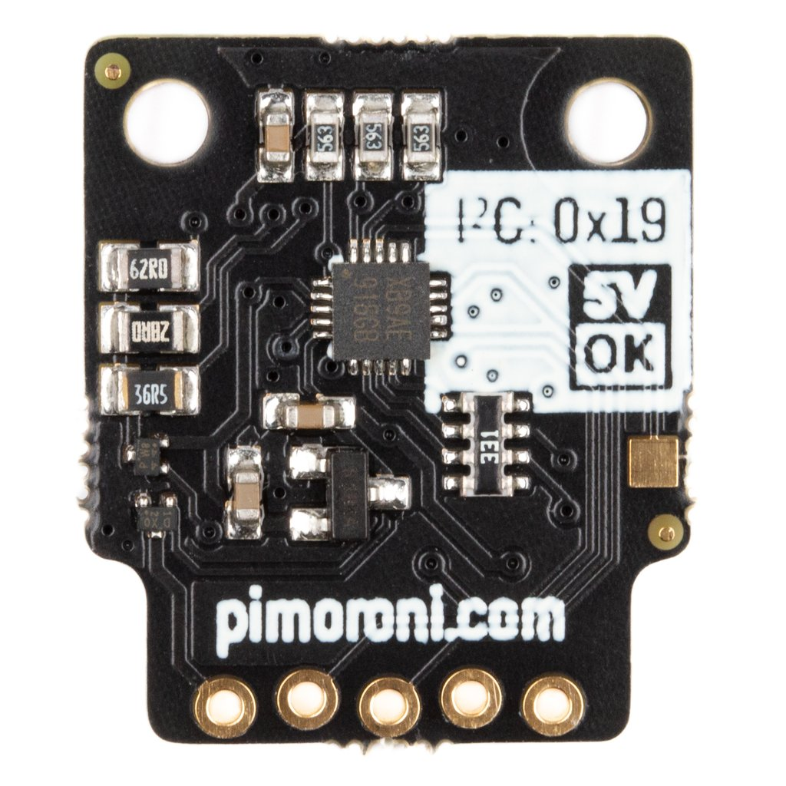
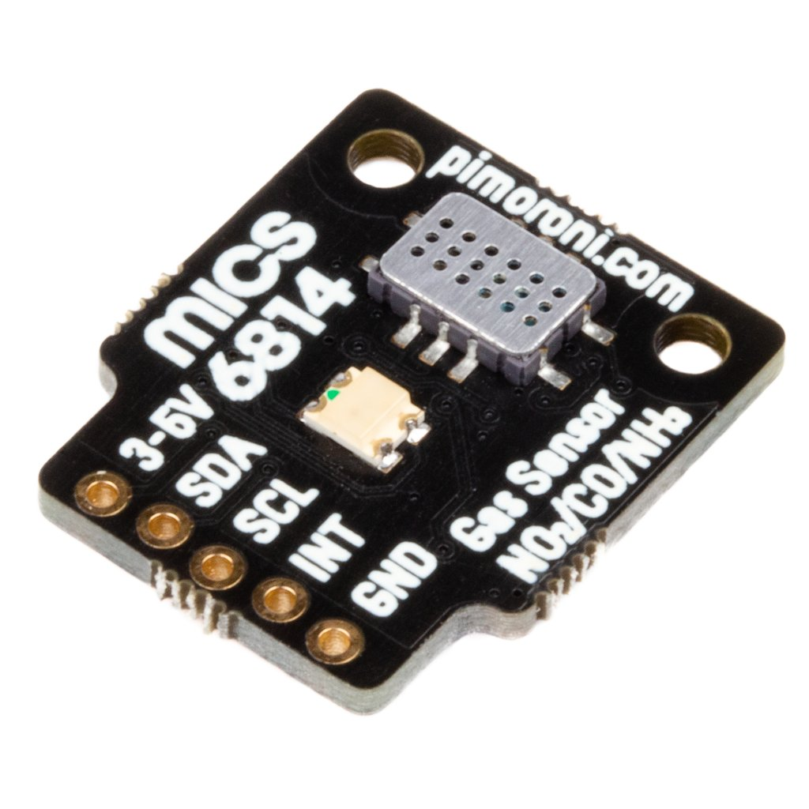

# MICS6814 Micropython driver
## Hardware
The MICS6814 sensor measures changes in the concentration of gases 
including carbon monoxide (CO), nitrogen dioxide (NO2), and ammonia (NH3) 
with this Breakout Garden compatible I2C breakout.The breakout board
uses a Nuvoton MS51 microcontroller to give you an I2C interface for the sensor(redundant huh!)

<p align="center">
</img>
</img>
</p>

## Usage
### Connections
* `SCL` -> GPIO22
* `SDA` -> GPIO21
* `3.3v` -> 3.3v
* `GND` -> GND
* `int` is not in use

### ESP32 usage
```python
import time
from machine import Pin, I2C
from mics6814 import MICS6814


i2c = I2C(1,scl=Pin(22),sda=Pin(21),freq=100000)
gas = MICS6814(i2c)

try:
    while True:
        readings = gas.read_all()
        print(readings)
        time.sleep(1.0)
except KeyboardInterrupt:
    pass
```
### References
1. [Pimoroni python library](https://github.com/pimoroni/mics6814-python)
2. [Arduino library](https://github.com/eNBeWe/MiCS6814-I2C-Library)
